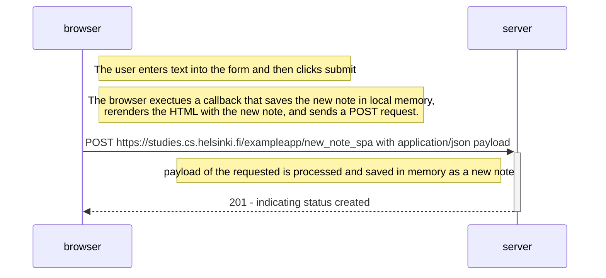

```mermaid

sequenceDiagram
    participant browser
    participant server


    Note right of browser: The user enters text into the form and then clicks submit

    Note right of browser: The browser exectues a callback that saves the new note in local memory,<br>rerenders the HTML with the new note, and sends a POST request.
    
    browser->>+server: POST https://studies.cs.helsinki.fi/exampleapp/new_note_spa with application/json payload
    Note left of server: payload of the requested is processed and saved in memory as a new note
    server-->>-browser: 201 - indicating status created

```